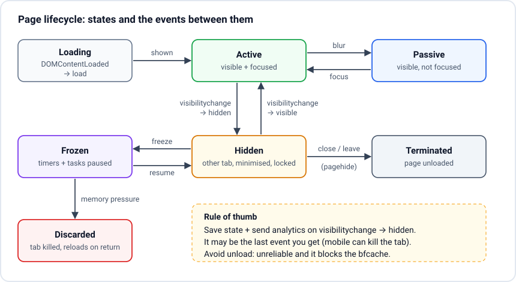

# Browser and page lifecycle

> **In one line:** A page goes from loading (`readystatechange`, `DOMContentLoaded`, `load`) to active, passive, hidden, frozen and finally terminated or discarded, and the one event you can trust before a user leaves is `visibilitychange` to `hidden`, not `unload` or `beforeunload`.

## Key points
- **Loading events, in order:**
  1. `document.readyState === 'loading'`: HTML is being parsed.
  2. `readyState` becomes `'interactive'`, deferred and module scripts run, then **`DOMContentLoaded`**: the DOM is ready. Images and iframes may still be loading.
  3. `readyState` becomes `'complete'`, then **`load`** on `window`: every subresource (images, stylesheets, iframes, fonts used so far) is done.
- **Leaving events:** `beforeunload` (can show "Leave site?"), `pagehide`, `unload`. `unload` is **unreliable** (often skipped on mobile) and **blocks the back/forward cache**, so do not use it. Chrome is phasing it out.
- **[Page Lifecycle API](https://developer.chrome.com/docs/web-platform/page-lifecycle-api) states:** **Active** (visible + focused), **Passive** (visible, not focused), **Hidden** (another tab, minimised, phone locked), **Frozen** (browser paused timers and tasks to save battery), **Terminated** (unloaded), **Discarded** (the browser killed the tab to free memory; the user sees a reload when they come back).
- **`visibilitychange`** is the last event you can rely on, especially on mobile where the OS can kill a backgrounded tab with no further events. Save state and send analytics there.
- **bfcache (back/forward cache):** the browser keeps the whole page in memory so Back is instant. Detect a restore with `pageshow` and `event.persisted`. `unload` handlers, `Cache-Control: no-store` and open connections can make a page ineligible.
- **Browser architecture behind it:** modern browsers are multi-process. A **browser process** (UI, network, storage), a **renderer process** per site (runs your JS, DOM, layout on its **main thread**, plus a **compositor** thread and raster threads), and a **GPU process**. This is why one crashed tab does not kill the browser. See [Inside a modern browser](https://developer.chrome.com/blog/inside-browser-part1).

## The picture


## Example
```js
// 1. Start app code when the DOM is ready (works even if the script loads late)
function start() { /* mount app, attach listeners */ }
if (document.readyState === 'loading') {
  document.addEventListener('DOMContentLoaded', start, { once: true });
} else {
  start();
}

// 2. Heavy, non-critical work after everything has loaded
window.addEventListener('load', () => {
  requestIdleCallback?.(() => import('./analytics.js'));
});

// 3. Save state and flush analytics when the user leaves or switches away
document.addEventListener('visibilitychange', () => {
  if (document.visibilityState === 'hidden') {
    localStorage.setItem('draft', JSON.stringify(getDraft()));
    navigator.sendBeacon('/rum', JSON.stringify(collectMetrics())); // survives page close
    pausePriceSocket();                                             // save battery and data
  } else {
    resumePriceSocket();
    refreshStaleData();
  }
});

// 4. Back/forward cache: the page was restored from memory, not reloaded
window.addEventListener('pageshow', (event) => {
  if (event.persisted) refreshStaleData(); // prices may be minutes old
});

// 5. Warn only when there is unsaved work, and remove the listener after saving
function onBeforeUnload(e) { e.preventDefault(); e.returnValue = ''; }
function setDirty(dirty) {
  if (dirty) window.addEventListener('beforeunload', onBeforeUnload);
  else window.removeEventListener('beforeunload', onBeforeUnload);
}

// 6. Frozen / discarded (Chromium)
document.addEventListener('freeze', () => closeConnections());
document.addEventListener('resume', () => reopenConnections());
if (document.wasDiscarded) restoreFromStorage();
```

## When to use it
- **Live dashboards:** pause the WebSocket or polling on `hidden`, refetch on `visible`. Saves battery and server load.
- **Forms:** auto-save drafts on `hidden`, warn with `beforeunload` only while dirty.
- **Analytics / RUM:** send the final [Web Vitals](https://web.dev/articles/vitals) (CLS and INP are only final when the page is hidden) with `navigator.sendBeacon` or `fetch(..., { keepalive: true })` on `visibilitychange`.
- **Framework lifecycles sit on top:** React `useEffect` cleanup, Svelte `$effect` teardown and `onMount` run on component mount/unmount, **not** when the tab closes. For tab-level events you still need these DOM events.

## Likely questions
### `DOMContentLoaded` vs `load`?
`DOMContentLoaded` fires when the HTML is fully parsed and deferred scripts have run. It does not wait for images or iframes. `load` fires after all of those are done too. Start app logic on `DOMContentLoaded`; use `load` for things that need images measured, or for low-priority work.

### Does `DOMContentLoaded` wait for CSS?
Not directly. But a classic (non-async) script waits for the CSS above it, and `DOMContentLoaded` waits for those scripts and for `defer` scripts. So in practice a big stylesheet in `<head>` plus scripts can delay `DOMContentLoaded`.

### Why not use `unload` to send analytics?
It often does not fire at all on mobile (the OS kills the tab after it goes to the background) and it prevents the page from entering the bfcache, which makes Back slower. Use `visibilitychange` to `hidden` (plus `pagehide` as a fallback) with `sendBeacon`, which the browser delivers even after the page is gone.

### What is the bfcache and how do you keep your page eligible?
The back/forward cache stores a full snapshot of the page (JS heap included) when you navigate away, so Back/Forward restores it instantly without reloading. To stay eligible: no `unload` listeners, avoid `Cache-Control: no-store` on the HTML unless you must, close IndexedDB connections and WebSockets on `pagehide` and reopen on `pageshow`. Chrome DevTools > Application > Back/forward cache tells you what blocks it.

### What happens to timers in a background tab?
Browsers throttle them. Timers in hidden tabs run at most about once per second, and Chrome adds stronger "intensive throttling" (about once per minute) after a few minutes hidden. `requestAnimationFrame` stops completely. So never rely on `setInterval` for accurate time in the background; compare `Date.now()` when the tab becomes visible again.

### Explain the browser's process architecture in short.
The browser process handles the UI, tabs, network and storage. Each site gets its own renderer process (site isolation) where your JS, style, layout and paint run on the main thread, with a compositor thread for scrolling and transforms. A GPU process draws to the screen. Separate processes give security (one site cannot read another's memory) and stability (a crash kills one tab).

## Common mistakes
- Using `unload` or `beforeunload` for analytics.
- Always registering `beforeunload`; it disables bfcache in Firefox and annoys users.
- Assuming a hidden tab keeps running timers and sockets normally.
- Forgetting `pageshow` with `persisted`, so a restored page shows stale data.
- Waiting for `load` to start the app, which can be seconds later on image-heavy pages.

## Resources
- [Chrome: Page Lifecycle API](https://developer.chrome.com/docs/web-platform/page-lifecycle-api) - all states, events and the diagram
- [MDN: Document visibilitychange event](https://developer.mozilla.org/en-US/docs/Web/API/Document/visibilitychange_event) - the reliable "user is leaving" signal
- [web.dev: Back/forward cache](https://web.dev/articles/bfcache) - how it works and what blocks it
- [javascript.info: Page lifecycle](https://javascript.info/onload-ondomcontentloaded) - DOMContentLoaded, load, beforeunload, readyState
- [Chrome: Inside a modern browser](https://developer.chrome.com/blog/inside-browser-part1) - processes and threads, 4-part series
