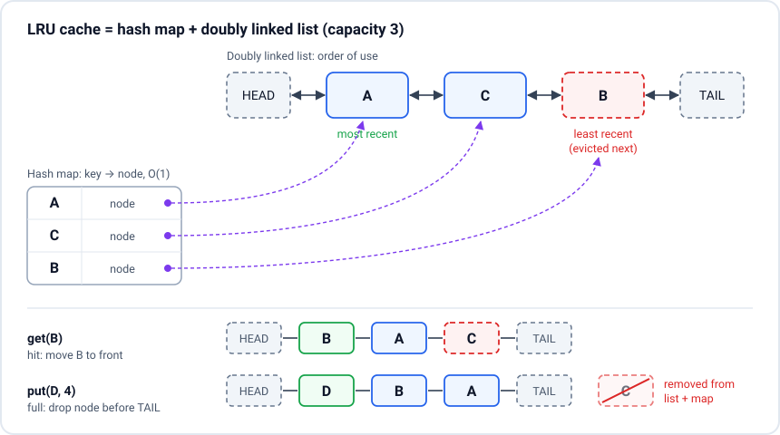

# LRU cache (implementation + UI)

> **In one line:** An LRU (Least Recently Used) cache holds at most `capacity` items, and when it is full it throws out the item that was used longest ago; a hash map gives O(1) lookup and a doubly linked list (or a JS `Map`'s insertion order) gives O(1) "move to most recent" and "evict oldest".

## Requirements to confirm
- API: `get(key)` returns the value or `-1` / `undefined`; `put(key, value)` inserts or updates. Both must be **O(1)** (this is the LeetCode 146 version).
- Does `get` count as a "use"? (Yes, normally. `get` and `put` both make the key the most recent.)
- Does updating an existing key count as a use? (Yes, and it must not evict anything.)
- Capacity 0 or negative? (Store nothing.)
- Bonus asks: TTL (expire after N ms), `onEvict` callback, size by bytes instead of count, a UI that shows the order.

## The picture (draw this first)

- **Map** answers "where is key X?" in O(1).
- **Doubly linked list** answers "who is oldest?" (node before `TAIL`) and lets you unlink any node in O(1) because each node knows its `prev` and `next`.
- `HEAD` and `TAIL` are dummy (sentinel) nodes, so you never special-case an empty list.

## Implementation 1: using `Map` (what you write first in JS)
A JS [`Map`](https://developer.mozilla.org/en-US/docs/Web/JavaScript/Reference/Global_Objects/Map) remembers insertion order, and `delete` + `set` moves a key to the end. So the **first** key is the least recently used.

```js
class LRUCache {
  constructor(capacity) {
    this.capacity = capacity;
    this.map = new Map(); // oldest first, newest last
  }

  get(key) {
    if (!this.map.has(key)) return -1;
    const value = this.map.get(key);
    this.map.delete(key);   // move to the end = most recent
    this.map.set(key, value);
    return value;
  }

  put(key, value) {
    if (this.capacity <= 0) return;
    if (this.map.has(key)) this.map.delete(key);
    this.map.set(key, value);
    if (this.map.size > this.capacity) {
      const oldestKey = this.map.keys().next().value; // first key = LRU
      this.map.delete(oldestKey);
    }
  }
}

const cache = new LRUCache(2);
cache.put(1, 'one');
cache.put(2, 'two');
cache.get(1);          // 'one'  -> order is now 2, 1
cache.put(3, 'three'); // full   -> evicts 2
cache.get(2);          // -1
[...cache.map.keys()]; // [1, 3]
```
All operations are O(1) on average. Say this out loud, then offer the linked-list version, because many interviewers say "now do it without relying on `Map` order".

## Implementation 2: hash map + doubly linked list (the classic answer)
```js
class Node {
  constructor(key, value) {
    this.key = key;      // keep the key so eviction can delete it from the map
    this.value = value;
    this.prev = null;
    this.next = null;
  }
}

class LRUCache {
  constructor(capacity) {
    this.capacity = capacity;
    this.map = new Map();               // key -> Node (only used as a hash map)
    this.head = new Node(null, null);   // dummy: head.next is the MOST recent
    this.tail = new Node(null, null);   // dummy: tail.prev is the LEAST recent
    this.head.next = this.tail;
    this.tail.prev = this.head;
  }

  #remove(node) {
    node.prev.next = node.next;
    node.next.prev = node.prev;
  }

  #addToFront(node) {
    node.prev = this.head;
    node.next = this.head.next;
    this.head.next.prev = node;
    this.head.next = node;
  }

  get(key) {
    const node = this.map.get(key);
    if (!node) return -1;
    this.#remove(node);
    this.#addToFront(node);
    return node.value;
  }

  put(key, value) {
    if (this.capacity <= 0) return;
    const existing = this.map.get(key);
    if (existing) {
      existing.value = value;
      this.#remove(existing);
      this.#addToFront(existing);
      return;
    }
    if (this.map.size === this.capacity) {
      const lru = this.tail.prev;
      this.#remove(lru);
      this.map.delete(lru.key);
    }
    const node = new Node(key, value);
    this.map.set(key, node);
    this.#addToFront(node);
  }

  // Handy for debugging and for the UI below: most recent first
  keys() {
    const out = [];
    for (let n = this.head.next; n !== this.tail; n = n.next) out.push(n.key);
    return out;
  }
}
```

| Operation | `Map` version | Map + linked list |
| --------- | ------------- | ----------------- |
| `get`     | O(1)          | O(1)              |
| `put`     | O(1)          | O(1)              |
| Space     | O(capacity)   | O(capacity)       |

## Bonus: TTL (expire after N ms)
```js
class TTLLRUCache {
  constructor(capacity, ttlMs) {
    this.capacity = capacity;
    this.ttlMs = ttlMs;
    this.map = new Map(); // key -> { value, expiresAt }
  }

  get(key) {
    const entry = this.map.get(key);
    if (!entry) return undefined;
    if (Date.now() > entry.expiresAt) { // lazy expiry: check on read
      this.map.delete(key);
      return undefined;
    }
    this.map.delete(key);
    this.map.set(key, entry);
    return entry.value;
  }

  put(key, value) {
    this.map.delete(key);
    this.map.set(key, { value, expiresAt: Date.now() + this.ttlMs });
    if (this.map.size > this.capacity) this.map.delete(this.map.keys().next().value);
  }
}
```

## Real use: cache API responses
```js
const quoteCache = new LRUCache(50); // keep the last 50 symbols the user looked at

async function getQuote(symbol) {
  const hit = quoteCache.get(symbol);
  if (hit !== -1) return hit;
  const res = await fetch(`/api/quote/${encodeURIComponent(symbol)}`);
  if (!res.ok) throw new Error(`HTTP ${res.status}`);
  const data = await res.json();
  quoteCache.put(symbol, data);
  return data;
}
```
Also used for: memoizing expensive pure functions with a size limit (an unbounded `memoize` is a memory leak), image/thumbnail caches, "recently viewed" lists, autocomplete result caches, and browser/CDN caches in general.

## UI: an LRU cache visualizer (machine-coding version)
The round-2 version: "Build a small UI that shows how an LRU cache works." The user sets a capacity, does `put` and `get`, and sees the order (most recent on the left), hits, misses and which key got evicted. The cache class stays plain JS; the UI only re-reads `keys()` after each operation.

### Requirements to confirm
- Inputs: capacity, key, value. Buttons: **Put**, **Get**, **Clear**.
- Show the items in order (MRU -> LRU), highlight the item just touched, mark the LRU item as "next to go".
- A log of operations: `get(B) -> hit`, `put(D) -> evicted C`.
- Keyboard and screen reader friendly: real `<form>`, `<label>`s, `aria-live` for the last result.

### Svelte 5
```svelte
<script>
  // LRUCache from "Implementation 2" above, with keys() and an onEvict hook
  import { LRUCache } from './lru.js';

  let capacity = $state(3);
  let cache = $state.raw(new LRUCache(3)); // class instance: replace, don't mutate deeply
  let items = $state([]);                  // [{ key, value }] most recent first
  let key = $state('');
  let value = $state('');
  let lastTouched = $state(null);
  let log = $state([]);                    // newest first

  function snapshot() {
    items = cache.keys().map((k) => ({ key: k, value: cache.map.get(k).value }));
  }

  function record(text, kind) {
    log = [{ id: crypto.randomUUID(), text, kind }, ...log].slice(0, 20);
  }

  function reset() {
    cache = new LRUCache(Number(capacity));
    items = [];
    log = [];
    lastTouched = null;
  }

  function put(e) {
    e.preventDefault();
    const k = key.trim();
    if (!k) return;
    const before = new Set(cache.keys());
    cache.put(k, value || k);
    const evicted = [...before].find((x) => !cache.map.has(x));
    record(evicted ? `put(${k}) -> evicted ${evicted}` : `put(${k})`, evicted ? 'evict' : 'put');
    lastTouched = k;
    key = '';
    value = '';
    snapshot();
  }

  function get() {
    const k = key.trim();
    if (!k) return;
    const v = cache.get(k);
    record(v === -1 ? `get(${k}) -> miss` : `get(${k}) -> hit: ${v}`, v === -1 ? 'miss' : 'hit');
    lastTouched = v === -1 ? null : k;
    snapshot();
  }
</script>

<section class="lru">
  <form onsubmit={put}>
    <label>Capacity <input type="number" min="1" max="10" bind:value={capacity} onchange={reset} /></label>
    <label>Key <input bind:value={key} required /></label>
    <label>Value <input bind:value={value} /></label>
    <button type="submit">Put</button>
    <button type="button" onclick={get}>Get</button>
    <button type="button" onclick={reset}>Clear</button>
  </form>

  <p class="legend">Most recent &larr; &rarr; Least recent ({items.length}/{capacity})</p>
  <ol class="slots">
    {#each items as item, i (item.key)}
      <li
        class:touched={item.key === lastTouched}
        class:lru={i === items.length - 1 && items.length === Number(capacity)}
      >
        <strong>{item.key}</strong>
        <span>{item.value}</span>
        {#if i === items.length - 1 && items.length === Number(capacity)}<small>evicted next</small>{/if}
      </li>
    {/each}
    {#each Array(Math.max(0, capacity - items.length)) as _, i (i)}
      <li class="empty" aria-hidden="true">empty</li>
    {/each}
  </ol>

  <p class="sr-only" aria-live="polite">{log[0]?.text ?? ''}</p>
  <ul class="log">
    {#each log as entry (entry.id)}
      <li class={entry.kind}>{entry.text}</li>
    {/each}
  </ul>
</section>

<style>
  .slots { display: flex; gap: 0.5rem; list-style: none; padding: 0; }
  .slots li {
    min-width: 5rem; padding: 0.5rem; border: 2px solid #ccc; border-radius: 8px;
    display: grid; text-align: center;
    transition: transform 200ms ease;  /* transform only: no layout per frame */
  }
  .touched { border-color: #16a34a; transform: translateY(-4px); }
  .lru { border-color: #dc2626; border-style: dashed; }
  .empty { color: #999; border-style: dotted; }
  .log .hit { color: #16a34a; }
  .log .miss, .log .evict { color: #dc2626; }
</style>
```

### React version of the same idea
```jsx
import { useReducer, useRef, useState } from 'react';
import { LRUCache } from './lru.js';

export function LRUVisualizer({ capacity = 3 }) {
  const cacheRef = useRef(new LRUCache(capacity)); // mutable class lives in a ref
  const [, rerender] = useReducer((n) => n + 1, 0); // force a render after mutating
  const [key, setKey] = useState('');
  const [log, setLog] = useState([]);

  const run = (op) => {
    const cache = cacheRef.current;
    const k = key.trim();
    if (!k) return;
    if (op === 'get') {
      const v = cache.get(k);
      setLog((l) => [`get(${k}) -> ${v === -1 ? 'miss' : 'hit'}`, ...l]);
    } else {
      const before = cache.keys();
      cache.put(k, k);
      const evicted = before.find((x) => !cache.map.has(x));
      setLog((l) => [`put(${k})${evicted ? ` -> evicted ${evicted}` : ''}`, ...l]);
    }
    setKey('');
    rerender();
  };

  return (
    <section>
      <input aria-label="Key" value={key} onChange={(e) => setKey(e.target.value)} />
      <button onClick={() => run('put')}>Put</button>
      <button onClick={() => run('get')}>Get</button>
      <ol style={{ display: 'flex', gap: 8, listStyle: 'none' }}>
        {cacheRef.current.keys().map((k) => <li key={k}>{k}</li>)}
      </ol>
      <ul aria-live="polite">{log.map((t, i) => <li key={i}>{t}</li>)}</ul>
    </section>
  );
}
```
Point to make: the cache is a **mutable class**, so React does not see changes. Either keep it in a `useRef` and force a render (above), or make the cache immutable and keep the key list in state. In Svelte, `$state.raw` plus re-reading `keys()` does the same job.

## Likely questions
### Why a doubly linked list and not a singly linked list?
To remove a node from the middle in O(1) you need its previous node. With a singly linked list you would have to walk from the head to find it, which is O(n). Each node in a doubly linked list knows `prev`, so unlinking is just two pointer changes.

### Why store the key inside the node?
On eviction you only have the tail node. You need its key to also delete it from the hash map, otherwise the map keeps a reference to a removed node (wrong answers and a memory leak).

### Why use dummy head and tail nodes?
So add and remove never have to check "is the list empty?" or "is this the first/last node?". Every real node always has a real `prev` and `next`. Fewer `if`s, fewer bugs under interview pressure.

### Is the `Map` version really O(1)?
Yes on average. `Map.has`, `get`, `set` and `delete` are hash-table operations, and `map.keys().next()` reads the first key in insertion order without walking the map. The spec only guarantees "sublinear on average", but V8 implements `Map` as a hash table, so in practice it is O(1).

### LRU vs LFU vs FIFO?
- **FIFO:** evict what was **added** first, ignores reads.
- **LRU:** evict what was **used** longest ago. Simple and good for "recent things get used again" (most UIs).
- **LFU (Least Frequently Used):** evict what has the fewest uses. Better when some keys are popular for a long time, but needs counts and tie-breaking, and old popular keys can get stuck.

### Where have you used an LRU cache in the frontend?
Caching API responses per key (symbol quotes, search results) so going back is instant, limiting a `memoize` helper so it cannot grow forever, and keeping the last N decoded images or charts. Libraries like TanStack Query use time-based garbage collection instead, but the idea of "cap the memory, drop the oldest" is the same.

### How would you make it work across tabs or survive a reload?
Persist it: write the key order and values to `localStorage` (small data) or IndexedDB (bigger data) after each change, debounced. For cross-tab, listen to the `storage` event or use a `BroadcastChannel`. Mention that the cache is now shared mutable state, so you need a version number or timestamps to resolve conflicts.

## Common mistakes
- Forgetting that `get` must also move the key to "most recent".
- Evicting before checking whether the key already exists (an update should never evict).
- Not deleting the evicted key from the map.
- Using an array and `indexOf`/`splice` to reorder. It works but is O(n); call it out if you start with it.
- In the UI, mutating the class and expecting React or Svelte to notice.

## Resources
- [LeetCode 146: LRU Cache](https://leetcode.com/problems/lru-cache/) - the standard problem statement
- [MDN: Map](https://developer.mozilla.org/en-US/docs/Web/JavaScript/Reference/Global_Objects/Map) - insertion order, `keys()`, `delete`
- [Wikipedia: Cache replacement policies](https://en.wikipedia.org/wiki/Cache_replacement_policies) - LRU, LFU, FIFO and more
- [Svelte: $state.raw](https://svelte.dev/docs/svelte/$state#$state.raw) - storing class instances without deep proxies
