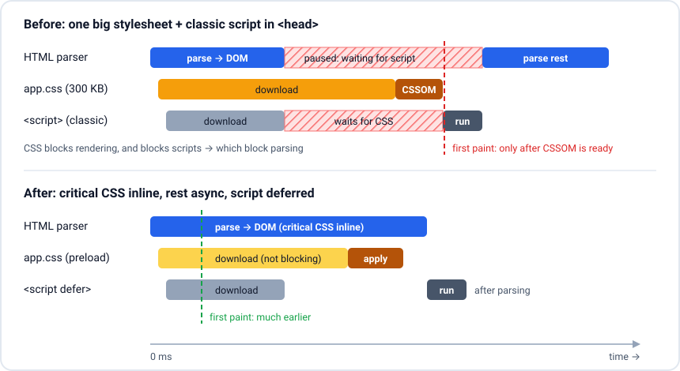

# Does CSS block rendering? Loading huge CSS

> **In one line:** Yes: CSS in the `<head>` is render-blocking (nothing paints until it is downloaded and parsed) and it can also block scripts, but it does not block HTML parsing; to load a huge stylesheet, inline the small critical part, load the rest asynchronously or split it by route and media, and cut what is unused.

## Key points
- **Render-blocking:** the browser will not paint until it has every stylesheet in `<head>` that applies to the current media. Otherwise users would see a flash of unstyled content (FOUC) and layout jumps.
- **Not parser-blocking:** the HTML parser keeps building the DOM while CSS downloads. The [preload scanner](https://web.dev/articles/preload-scanner) also keeps finding images and scripts.
- **But it blocks scripts:** a classic `<script>` after a `<link rel="stylesheet">` waits for that CSS (the script might call `getComputedStyle`). Since scripts block the parser, **CSS can indirectly block parsing**. `async` scripts do not wait for CSS.
- **`media` changes priority:** `<link rel="stylesheet" media="print">` or `media="(min-width: 1024px)"` on a phone still downloads, at low priority, and **does not block rendering**.
- **`@import` inside CSS is slow:** the browser finds the imported file only after downloading and parsing the parent, so it is a waterfall. Use `<link>` tags or bundle instead.
- **Stylesheets in `<body>`** (Chrome) block rendering only of the content after them, so later sections can come with their own CSS.
- **Big CSS hurts twice:** download time (blocks first paint, LCP) and **style recalculation** time (more rules x more DOM nodes = slower every style change).

## The picture


## How to load a huge CSS file
```html
<head>
  <!-- 1. Critical CSS inline: only what the first screen needs (~10-15 KB max) -->
  <style>
    :root { --bg: #fff; }
    body { margin: 0; font: 16px/1.5 system-ui; }
    .header, .hero, .grid-shell { /* above-the-fold layout only */ }
  </style>

  <!-- 2. The rest loads without blocking paint -->
  <link rel="preload" href="/css/app.css" as="style" onload="this.onload=null;this.rel='stylesheet'">
  <noscript><link rel="stylesheet" href="/css/app.css"></noscript>

  <!-- Alternative trick: a non-matching media is non-blocking, then switch it on -->
  <link rel="stylesheet" href="/css/below-fold.css" media="print" onload="this.media='all'">

  <!-- 3. Split by media so a phone does not wait for desktop or print CSS -->
  <link rel="stylesheet" href="/css/desktop.css" media="(min-width: 1024px)">
  <link rel="stylesheet" href="/css/print.css" media="print">

  <!-- 4. If CSS lives on another origin (CDN), connect early -->
  <link rel="preconnect" href="https://cdn.example.com" crossorigin>
</head>
```

Then, in order of impact:
1. **Remove unused CSS.** Chrome DevTools **Coverage** tab shows unused bytes. Often 70-90% of a big framework CSS is unused on any page. Tailwind already generates only the classes you use; for others use PurgeCSS or switch to component-scoped CSS.
2. **Split by route.** Vite, SvelteKit, Next.js and webpack (`mini-css-extract-plugin`) emit one CSS file per lazy-loaded route or component, so the login page does not download the dashboard CSS.
3. **Minify and compress.** Minify (Lightning CSS, cssnano), serve with **Brotli** or gzip. CSS compresses very well (often 80%+).
4. **Cache it long.** Hashed file names (`app.3f9a1c.css`) + `Cache-Control: public, max-age=31536000, immutable`. Repeat visits pay nothing.
5. **Make the rest cheap to render.** `content-visibility: auto` on long below-the-fold sections skips their style and layout until they scroll near. Simple selectors and fewer DOM nodes speed up style recalculation.
6. **Fonts referenced from CSS:** use `font-display: swap` and preload the main font, so text is not invisible while fonts load.

```js
// Build-time critical CSS (e.g. with the "critical" package)
import { generate } from 'critical';

await generate({
  src: 'dist/index.html',
  target: { html: 'dist/index.html' }, // inlines critical CSS, defers the rest
  inline: true,
  dimensions: [{ width: 375, height: 812 }, { width: 1440, height: 900 }],
});
```

## When to use it
- **Landing pages and first visits** where LCP matters: critical CSS + async rest.
- **Big legacy apps** with one 500 KB `styles.css`: Coverage first, then per-route split, then critical CSS.
- **SvelteKit:** CSS is already split per component/route; `kit.inlineStyleThreshold` inlines small CSS files into the HTML.
- **Next.js:** CSS Modules and per-route CSS chunks are automatic; global CSS is loaded on every page, so keep it small.

## Likely questions
### Does CSS block rendering? Does it block parsing?
It blocks **rendering**, not **parsing**. The DOM is built while CSS downloads, but nothing is painted until the CSSOM for the current media is ready. It can block parsing indirectly: a normal script after a stylesheet waits for the CSS, and the parser waits for the script.

### Does CSS block JavaScript?
Yes for classic scripts that come after the stylesheet: they will not run until the CSS is loaded, because they might read computed styles. `async` scripts do not wait. `defer` and module scripts run after parsing; in practice they also run after preceding stylesheets are loaded.

### How do you load a 2 MB CSS file without hurting first paint?
First question whether it needs to be 2 MB: run Coverage and remove unused rules, split it per route, and minify plus Brotli. Then inline the critical above-the-fold CSS in `<head>` and load the rest with `rel="preload"` + `onload` (or the `media="print"` swap trick). Use media queries on `<link>` so mobile users do not wait for desktop CSS, give it a hashed name with a long cache, and use `content-visibility: auto` so the browser skips styling off-screen sections.

### What are the downsides of critical CSS?
Inlined CSS is not cached separately, so it is re-downloaded with every HTML response; keep it small. It must be regenerated when the design changes (automate it in the build). If the async CSS arrives late, below-the-fold content can briefly look unstyled or shift, which can hurt CLS, so reserve space for those sections.

### Why is `@import` bad for performance?
The browser discovers the imported stylesheet only after downloading and parsing the file that imports it, creating a serial chain of requests, all render-blocking. `<link>` tags in the HTML are found by the preload scanner and download in parallel. Bundlers inline `@import`s at build time, which also fixes it.

### Is a CSS-in-JS library a problem here?
Runtime CSS-in-JS (styles generated in JS on the client) means styles only exist after JS downloads and runs, so first paint waits for JS, and it adds style recalculation work on every render. Zero-runtime options (CSS Modules, Tailwind, vanilla-extract, Linaria) extract a static CSS file at build time.

## Common mistakes
- Putting every stylesheet in `<head>` without `media`, including print and desktop-only CSS.
- Using `@import` chains in production CSS.
- Inlining the whole stylesheet ("critical CSS" of 200 KB) and making the HTML huge.
- Async-loading all CSS, so the page paints unstyled and then jumps (bad CLS).
- Forgetting the `<noscript>` fallback for the preload trick.

## Resources
- [web.dev: Render-blocking CSS](https://web.dev/articles/critical-rendering-path/render-blocking-css) - what blocks and how media queries help
- [web.dev: Defer non-critical CSS](https://web.dev/articles/defer-non-critical-css) - the preload pattern step by step
- [web.dev: Extract critical CSS](https://web.dev/articles/extract-critical-css) - tools and trade-offs
- [Chrome DevTools: Coverage](https://developer.chrome.com/docs/devtools/coverage) - find unused CSS and JS
- [MDN: content-visibility](https://developer.mozilla.org/en-US/docs/Web/CSS/content-visibility) - skip rendering off-screen content
